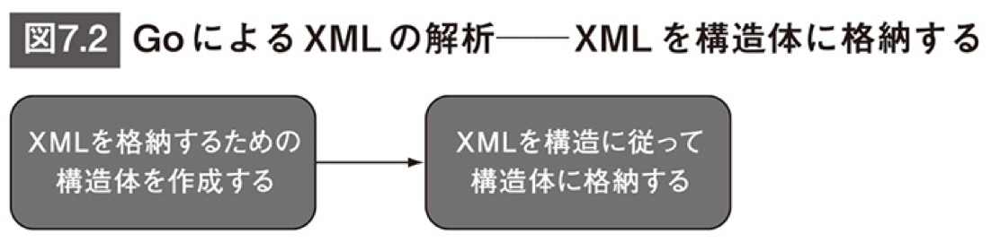
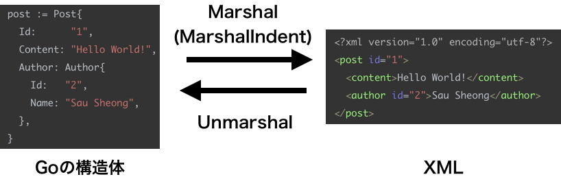
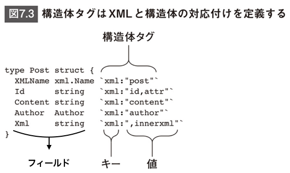
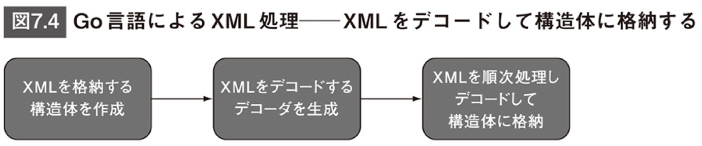
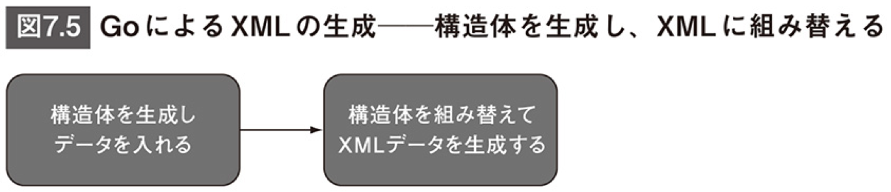
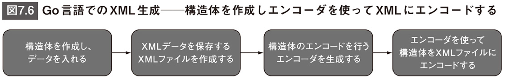

# 第７章 GoによるWebサービスの作成-XMLおよびJSONの生成と解析

## はじめに

- *このリポジトリは[[秋葉原] Goプログラミング実践入門 輪読会 (初心者歓迎！)](https://weeyble-go.connpass.com/event/172045/)の発表資料として用意したリポジトリです。*
- *書籍の要約は正体、担当者の理解で書いているところは斜体で記載しています*
- *権利関係で問題があればご指摘ください*

## アジェンダ

| 節                                | 概要                                                         | 輪読会での説明方針                                         |
| --------------------------------- | ------------------------------------------------------------ | ---------------------------------------------------------- |
| 7.1 Webサービス入門               | - 本章におけるWebサービスの定義<br />- 本章で説明の中心となるSOAP/RESTといったアーキテクチャ・デザイン手法やXML/JSONといったデータフォーマットに関する概要の説明 | Go出てこないからさらっと説明                               |
| 7.2 SOAPベースのWebサービスの基本 | - SOAPの基本的な説明<br />- 本章だとこの後SOAPの話は出てこない | Go出てこないしSOAPの話はその後出てこないから超さらっと説明 |
| 7.3 RESTベースのWebサービスの基本 | - RESTの基本的な説明                                         | Go出てこないからさらっと説明                               |
| 7.4 Go言語によるXMLの解析と生成   | - 7.4.1でXMLの解析について説明し、7.4.2でXMLの生成について説明<br />- 7.4.1では小さなXMLファイルが用途の関数Unmarshalと、ストリーム処理や大きなXMLが用途の構造体Decoderを説明<br />- 7.4.2ではその逆の働きをする関数Marshal(MarshalIndent)と構造体Encoderを使って、XMLの生成について説明<br />- 7.4.1をやれば、7章全体の半分以上はやったといっても過言ではないと思う。 | コードを見ながらしっかり説明                               |
| 7.5 Go言語によるJSONの解析と生成  | - 基本XMLの説明と同じ                                        | さらっと説明                                               |
| 7.6 Go Webサービスの作成          |                                                              | 動かしてさらっと説明                                       |
| 7.7 まとめ                        |                                                              | さらっと説明                                               |


## 7.1 Webサービス入門

- エンドユーザが人間だとWebアプリ、エンドユーザがソフトウェアだとWebサービス*（この定義って一般的ですか？個人的には違和感があるのですが。。。）*
- Go言語の用途の１つとしてWebサービスの作成が挙げられる
- WebサービスにはSOAPベース、RESTベース、XML-RPCベースなど様々ある
- *以下の引用の通り、適材適所での使い分けが大切と思われる*

```
開発者や企業がSOAPベースとRESTベースのWebサービスを別の目的のために同時に採用することもよくあります。その場合、SOAPは企業内部を統合するための社内用アプリケーションに使われ、RESTは外部のサードパーティの開発者向けに使われます。この方式を採用すれば、双方の強み（RESTの高速性とシンプルさ、SOAPのセキュリティと堅牢性）を効果的に利用することができます。
```

- *昨今だとSOAPは聞かなくなったように思うが、マイクロサービスの文脈ではgRPCを聞くようになった。「サービス間の通信にはgRPCを使って、外向けにはREST APIを公開する」といった使い分けをよく聞くので、やっぱり大切なのは適材適所での使い分けなのかと思っている。*
- *[fukabori.fm ep29. 技術選定の審美眼(2) w/ twada](https://fukabori.fm/episode/29)では、技術は螺旋のように進化する、と言う話の中でSOAPやREST, XMLやJSONの話が出てきて面白かったです。*

## 7.2 SOAPベースのWebサービスの基本

- SOAPはXMLで定義された構造化データを交換するためのプロトコル
- Simple Object Access Protocolの略だけど複雑になってしまっている

## 7.3 RESTベースのWebサービスの基本

- RESTはOOPの考え方の延長線上に進化したもの

- 関数を公開してサービスとして呼び出すのではなく、「リソース」と呼ばれるモデルを公開して、それに対して少数のアクション（「動詞」）を許可する

- 利用可能なHTTPメソッドの範囲に機能が制限されるので、`ACTIVATE /user/456 HTTP/1.1`のようなリクエストは送れない。よく使われる回避策を２つ挙げる。

  - アクションをリソースに変える

    ```
    POST /user/456/activation HTTP/1.1
    {"date": "20150515T13:05:05Z"}
    ```

  - アクションをリソースの属性にする

    ```
    PATCH /user/456 HTTP/1.1
    {"active": "true"}
    ```

## 7.4 Go言語によるXMLの解析と生成

- ライブラリencoding/xmlを使う

### 7.4.1 XMLの解析

#### 関数Unmarshalを用いたXMLの解析（小さなXMLファイル向け）

- 手順（２ステップ）
  

- *XML化するのがMarshalかUnmarshalかわからなくなってしまったので図示した。Goの世界から見たときに、XML化するのがMarshal（組織化する, 整理する）, XMLをGoの世界に持ってくるのがUnmarshal（無秩序な状態にする）。*



- 構造体タグ
  - Go言語はこの構造タグを使って構造体とXML要素の対応付けを決定する
  - XMLではキーは常にxml
  - フィールドの名前は大文字で始める（すべての場所から参照可能である必要があるため）



- 構造体タグが従うべき規則
  1. XML要素名自体を保存するには（通常は構造体名が要素名になる）、XMLNameという名前でxml.Nameという型のフィールドを追加する。要素名がこのフィールドに保存される。
  2. XML要素の属性を保存するには、属性と同じ名前のフィールドを定義し、`xml:"<属性名>,attr"`という構造体タグを使用する。ここで<属性名>はXML属性の名前。
  3. XML要素の文字データを保存するには、XML要素タグと同名のフィールドを定義し、`xml:",chardata"`という構造体タグを使用する。
  4. XML要素から未処理のままで（生の）XMLを得るには、フィールドを定義し（名前は何でもかまわない）`xml:",innerxml"`という構造体タグを使用する。
  5. モードフラグ（,attr、,chardata、,innerxmlなどのようなもの）がない場合、構造体のフィールドは構造体名と同じ名前のXML要素と対応付けられる。
     1. *モードフラグattrの場合：2*
     2. *モードフラグchardataの場合：3*
     3. *モードフラグinnerxmlの場合：4*
        *2, 3, 4に当てはまらない場合、構造体のフィールドは構造体名と同じ名前のXML要素と対応付けられる。モードフラグは「,」の後についている。* 
  6. 木構造を追ってXML要素に到達するのではなく、要素を直接取得したい場合は、構造体タグ`xml:"a>b>c"`を使う。ここでaとbは中間の要素で、cは取得したいノード。

- *書籍だとシンプルなXMLの解析をリスト7.2、少し複雑なXMLの解析をリスト7.5, 7.6で説明しているが、いきなりリスト7.5, 7.6の説明でも問題なさそうなので、リスト7.5, 7.6のサンプルプログラム[05xml_parsing_unmarshal_2/xml.go](05xml_parsing_unmarshal_2/xml.go)と[05xml_parsing_unmarshal_2/post.xml](05xml_parsing_unmarshal_2/post.xml)を見ながら説明。*

- 実行結果は以下の通り

  ```xml
  $ go run xml.go
  post
  1
  Hello World!
  {2 Sau Sheong}
  
    <content>Hello World!</content>
    <author id="2">Sau Sheong</author>
    <comments>
      <comment id="1">
        <content>Have a great day!</content>
        <author>Adam</author>
      </comment>
      <comment id="2">
        <content>How are you today?</content>
        <author>Betty</author>
      </comment>
    </comments>
  
  2
  Sau Sheong
  [{1 Have a great day! { Adam}} {2 How are you today? { Betty}}]
  1
  Have a great day!
  { Adam}
  2
  How are you today?
  { Betty}
  ```

#### 構造体Decoderを用いたXMLの解析（ストリーム処理や大きなXML向け）

- 手順（３ステップ）
  

- 型アサーション

  - ```go
    	// tはdecoderから取得したトークン。トークンの型をチェックする。	
    	switch se := t.(type) {
    		case xml.StartElement:
    			if se.Name.Local == "comment" {
    				var comment Comment
    				decoder.DecodeElement(&comment, &se)
    				fmt.Println(comment)
    			}
    		}
    ```

  - *スターティングGo言語の型アサーションの説明がわかりやすかったので、それで説明。*

### 7.4.2 XMLの生成

#### 関数Marshalを用いたXMLの生成（小さなXMLファイル向け）

- 手順（２ステップ）
- コード
  - [07xml_creating_marshal/xml.go](07xml_creating_marshal/xml.go)

#### 構造体Encoderを用いたXMLの生成（ストリーム処理や大きなXML向け）

- 手順（４ステップ）
- コード
  - [08xml_creating_encoder/xml.go](08xml_creating_encoder/xml.go)

## 7.5 Go言語によるJSONの解析と生成

- JSON（JavaScriptSerializedObjectNotation）は、JavaScriptを基礎としたテキストベースの軽量データフォーマット
- JSONの背景にある考え方は、「人間にとっても機械にとっても読みやすいもの」

### 7.5.1 JSONデータの解析

- Unmarshalのコードと解析対象JSON
  - [10json_parsing_unmarshal/json.go](10json_parsing_unmarshal/json.go)
  - [10json_parsing_unmarshal/post.json](10json_parsing_unmarshal/post.json)
- Decoderのコードと解析対象JSON
  - [11json_parsing_decoder/json.go](11json_parsing_decoder/json.go)
  - [11json_parsing_decoder/post.json](11json_parsing_decoder/post.json)

### 7.5.2 JSONデータの生成

- Marshalのコード
  - [12json_creating_marshal/json.go](12json_creating_marshal/json.go)
- Encoderのコード
  - [13json_creating_encoder/json.go](13json_creating_encoder/json.go)

## 7.6 Go Webサービスの作成

- [Docker Compose用コード](https://github.com/yasugahira0810/go-jissen)

## 7.7 まとめ

- 略